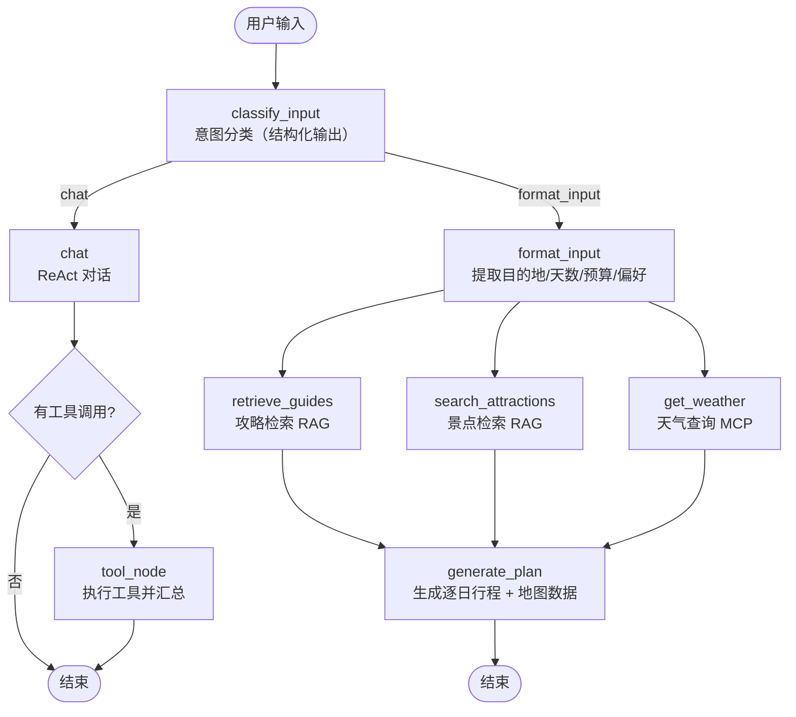

# TripGenie · 智能旅行规划助手

用一句自然语言描述旅行需求，系统自动完成 **需求解析 → 攻略检索 → 景点搜索 → 天气查询 → 生成逐日行程 → 渲染地图路线**，并以 SSE 流式输出实时展示 Agent 的中间思考过程。

个人项目，目标是完整跑通一个 LLM Agent 的工程化闭环：**工作流编排、工具接入、检索增强、流式输出、状态持久化**。

---

## 界面预览

<!-- TODO: 补充截图 -->

---

## 功能特性

### 1. 意图识别与双分支路由

入口节点用 LLM 的**结构化输出**（`with_structured_output` + `Literal["chat", "format_input"]`）判断用户意图，再由条件边路由，而不是靠关键词匹配堆 if-else。

- **chat 分支**：闲聊或单一工具诉求（天气、景点、交通、美食）。走标准 ReAct 循环——模型自主决定调用哪些工具，工具结果回灌后再由模型汇总成自然语言回复，单轮支持多工具并发调用。
- **format_input 分支**：多天行程规划这类复杂任务，进入下方的规划链路。

### 2. 行程规划：并行检索 + 汇聚生成

需求解析节点把自然语言拆成结构化字段（目的地 / 天数 / 预算 / 偏好），然后**扇出到三个互相独立的节点并行执行**：

- `retrieve_guides` —— 从攻略库做 RAG 检索
- `search_attractions` —— 从景点库做 RAG 检索
- `get_weather` —— 通过 MCP 工具查天气

三者全部完成后**汇聚**到 `generate_plan`，把检索结果、天气、预算等一起喂给模型，用流式方式生成结构化行程 JSON（逐日活动、时间、花费、备注、贴士）。

### 3. 行程地图可视化

生成的行程文本本身不含坐标，需要一次**反向结构化**：

1. 用 LLM 从行程中抽取"值得参观的景点/地标"，并标注它出现在第几天
2. 逐个调用高德 MCP 的地理编码工具拿经纬度（城市名 + 景点名组合搜索以提高命中率）
3. 调用驾车路径规划工具生成路线，拿到 polyline、距离与耗时
4. 前端按天渲染独立地图：编号 marker + 彩色路线 + 距离/耗时列表

工程上处理了几个实际问题：**跨天不生成路线**（避免画出"第 1 天景点 → 第 2 天景点"的假路线）；MCP 返回格式在不同工具间不一致，做了多层兼容解析并在 JSON 解析失败时降级为正则提取；地理编码失败时回落到配置的兜底坐标。

### 4. MCP 协议接入外部工具

通过 `langchain-mcp-adapters` 的 `MultiServerMCPClient`，以 **stdio** 方式拉起两个 MCP Server：

| MCP Server | 用途 |
|---|---|
| `amap-mcp-server` | 高德地图：地理编码、路径规划 |
| `mcp-server-time` | 时间查询（本地时区 Asia/Shanghai） |

MCP 工具与自研工具（RAG 检索、天气查询）合并成统一工具集交给模型调度，并支持按名称屏蔽指定工具。新增工具只需改工具注册处，**不必改动工作流定义**。

### 5. 全链路流式输出与"思考链"

后端基于 `workflow.astream_events(version="v2")` 捕获节点级事件，包装成自定义 SSE 协议下发：

| 事件 | 含义 |
|---|---|
| `thread_id` | 会话 ID（新会话时由后端生成） |
| `node_start` / `node_end` | 某个工作流节点开始/结束 |
| `chunk` | 模型流式输出的文本片段 |
| `trip_plan` | 结构化的完整行程（含地图数据） |
| `done` / `error` | 结束或异常 |

前端不依赖任何 SSE 库，用 `fetch` + `ReadableStream` + `TextDecoder` 手工解析分帧（因为原生 `EventSource` 只支持 GET，无法带 JSON body）。节点事件被渲染成可折叠的"思考过程"时间线，文本片段进缓冲区后按固定速率平滑打印，避免网络抖动造成的一顿一顿。

### 6. 多轮会话与历史回放

- **图状态持久化**：LangGraph `AsyncSqliteSaver` 按 `thread_id` 做检查点，多轮对话能接上上下文
- **业务侧存储**：另建 SQLite 的 `sessions` / `messages` 表管理会话列表（含索引、级联删除、按首条用户消息自动生成会话名）
- **历史回放**：行程产生的地图数据以 JSON 存进消息表，重新打开历史会话时地图能原样恢复

---

## 系统架构

### 工作流



### 技术栈

| 层次 | 技术 |
|---|---|
| Agent 编排 | LangGraph（StateGraph / 条件边 / 并行扇出 / Checkpointer） |
| 工具协议 | MCP（`langchain-mcp-adapters`，stdio transport） |
| 大模型 | 通义千问 / 阿里云百炼兼容模式；`with_structured_output` 做意图分类 |
| RAG | Chroma 向量库、DashScope 向量模型、Markdown 按标题层级分块 |
| 后端 | Python 3.12+、FastAPI、SSE、asyncio |
| 存储 | SQLite（业务库 + LangGraph 检查点） |
| 前端 | Vue 3（Composition API）、Vite、原生 ReadableStream 解析 SSE、高德地图 JS API |
| 外部服务 | 高德地图开放平台、天气 API |

### 目录结构

```
TripGenie/
├── requirements.txt
├── .env.example
├── backend/
│   ├── run.py                       # 启动入口（uvicorn）
│   └── app/
│       ├── main.py                  # FastAPI 应用、CORS、路由注册
│       ├── config.py                # 配置（统一读 .env）
│       ├── api/
│       │   ├── chat.py              # SSE 流式对话接口
│       │   └── history.py           # 会话 / 消息接口
│       ├── core/
│       │   ├── langgraph_app.py     # 工作流图定义
│       │   ├── agents.py            # 各节点实现 + 地图数据生成
│       │   ├── state.py             # TripState 状态定义
│       │   ├── tools.py             # 自研工具（RAG 检索、天气）
│       │   └── checkpointer.py      # LangGraph SQLite 检查点
│       ├── mcp/
│       │   └── client.py            # MCP Server 接入与工具合并
│       ├── rag/                     # 文档加载 / 分块 / 向量库 / 检索
│       ├── services/                # SQLite 会话服务、天气服务
│       ├── models/                  # 请求 / 响应模型
│       └── data/                    # 攻略文档、向量库、城市编码表
└── frontend/
    ├── index.html
    ├── vite.config.js               # 含 /api 反向代理
    └── src/
        ├── App.vue                  # 侧边栏 + 主区域布局
        ├── views/ChatView.vue       # 对话主界面（SSE 解析、思考链）
        ├── components/chat/         # 行程卡片、详情弹窗、每日地图、思考链
        ├── composables/useSessions.js
        └── utils/api.js
```

---

## 快速开始

### 环境要求

- **Python >= 3.12**
- **Node.js >= 18**
- **uvx**（用于拉起 MCP Server）：`pip install uv`
- 一个阿里云百炼 API Key（[控制台](https://bailian.console.aliyun.com/)）
- 两个高德地图 Key（[控制台](https://console.amap.com/dev/key/app)）：
  - **Web 端（JS API）** Key —— 前端渲染地图用，记得把 `localhost` 加进域名白名单
  - **Web 服务** Key —— 后端透传给 MCP，用于地理编码和路径规划

### 1. 安装后端依赖

```bash
git clone https://github.com/kkszw/TripGenie.git
cd TripGenie
pip install -r requirements.txt
```

### 2. 配置环境变量

```bash
cp .env.example .env          # Windows: copy .env.example .env
```

按 `.env` 里的注释填入真实值，其中：

| 变量 | 说明 |
|---|---|
| `DASHSCOPE_API_KEY` | 百炼 API Key，对话与向量化共用 |
| `DASHSCOPE_MODEL` | 对话模型名 |
| `DASHSCOPE_EMBEDDINGS` | 向量模型名 |
| `AMAP_API_KEY` | 高德 **Web 服务** Key，会透传给 MCP Server |
| `WEATHER_API_KEY` | 天气接口（可不填，天气节点失败不影响主流程） |
| `UVX_PATH` | uvx 可执行文件路径。**留空则自动探测** PATH 与当前虚拟环境 |

前端另有一份：

```bash
cd frontend
cp .env.example .env          # 填入 VITE_AMAP_JS_KEY（高德 Web 端 JS API Key）
```

### 3. 启动后端

```bash
cd backend
python run.py
```

服务监听 `http://localhost:8000`，接口文档见 `http://localhost:8000/docs`。

> ⚠️ **必须在 `backend/` 目录下启动**。`CHROMA_DB_PATH` / `CHECKPOINT_DB_PATH` 是相对路径且按当前工作目录解析，换目录启动会另建一套数据库。

### 4. 初始化 RAG 向量库（首次运行必须）

```bash
cd backend
python -m app.rag.init_rag_database
```

会读取 `app/data/travel_guide/` 下的 Markdown 攻略，分块后写入 Chroma。

### 5. 启动前端

```bash
cd frontend
npm install
npm run dev
```

访问 `http://localhost:5173`。Vite 已配置 `/api` 反向代理到 `localhost:8000`，无需额外跨域设置。

---

## API 接口

| 方法 | 路径 | 说明 |
|---|---|---|
| `POST` | `/api/chat/stream` | 发送消息，**SSE 流式**返回 Agent 响应 |
| `GET` | `/api/history/` | 获取会话列表（`?user_id=default`） |
| `POST` | `/api/history/sessions` | 新建会话 |
| `GET` | `/api/history/{thread_id}` | 获取会话详情及其全部消息 |
| `PUT` | `/api/history/sessions/{thread_id}` | 重命名会话 |
| `DELETE` | `/api/history/{thread_id}` | 删除会话（消息级联删除） |
| `GET` | `/health` | 健康检查 |

`/api/chat/stream` 请求体：

```json
{
  "thread_id": "可选，不传则后端新建并返回",
  "message": "帮我规划三亚3天度假，预算5000，喜欢海滩和海鲜",
  "context": {}
}
```

---

## 已知限制与后续计划

- **RAG 知识库只有 1 篇示例攻略**，检索效果受限；加载器已支持 Markdown 层级分块与 PDF，扩充语料即可
- **暂无自动化测试与 CI**，目前靠手工回归
- **暂无容器化部署**，且数据库路径依赖启动目录（见上方警告）
- **无用户体系**，`user_id` 固定为 `default`，会话未做隔离
- **地图兜底坐标是全局配置**，理想做法是先解析目的地城市中心再作为回落点
